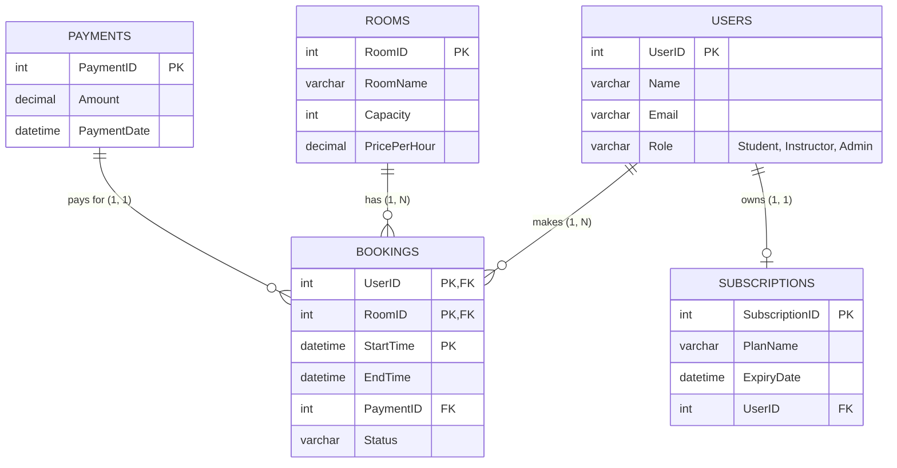

# Study Space Booking System ER Diagram

This document contains the Entity-Relationship (ER) model and requirements for the Study Space Booking System database.

## 1. Database Model Design

### 1) Requirements and Specification
The **Study Space Management Dashboard** is a custom database system designed to facilitate the booking of study rooms and tracking of user subscriptions. Its target environment is a university library or a private study space provider.
- **Users** can register as Students, Instructors, Receptionists, or Admins.
- **Rooms** represent the physical spaces available for booking, each having a specific capacity and price.
- **Subscriptions** track the active plans for users (e.g., Monthly Student Plan, Premium Instructor Plan).
- **Payments** record the financial transactions for bookings.
- **Bookings** represent the reservation of a room by a user. The Booking entity is a **Weak Entity** because a booking cannot exist independently without a User and a Room. It uses a composite primary key consisting of the identifiers of its parent entities (`UserID`, `RoomID`) combined with a `StartTime` discriminator.

### 2) ER Diagram

Below is the Mermaid representation of the ER diagram:

**Constraints & Details:**
- **Entities (5)**: USERS, ROOMS, SUBSCRIPTIONS, PAYMENTS, BOOKINGS (Weak Entity).
- **Relationships (4)**:
  1. `USERS` (1) to `BOOKINGS` (N) - A user can make multiple bookings.
  2. `ROOMS` (1) to `BOOKINGS` (N) - A room can have multiple bookings.
  3. `USERS` (1) to `SUBSCRIPTIONS` (1) - A user can own at most one active subscription.
  4. `PAYMENTS` (1) to `BOOKINGS` (N) - A payment can cover one or more bookings (though typically 1:1, payment can be null if unpaid).
- **Weak Entity**: `BOOKINGS` is a weak entity because it relies on `USERS` and `ROOMS` for its identifying relationships. Its primary key is the combination of `UserID`, `RoomID`, and `StartTime`.

### 3) Relational Schema Conversion
- **USERS**(<u>UserID</u>, Name, Email, Role)
- **ROOMS**(<u>RoomID</u>, RoomName, Capacity, PricePerHour)
- **SUBSCRIPTIONS**(<u>SubscriptionID</u>, PlanName, ExpiryDate, *UserID*)
- **PAYMENTS**(<u>PaymentID</u>, Amount, PaymentDate)
- **BOOKINGS**(<u>*UserID*, *RoomID*, StartTime</u>, EndTime, *PaymentID*, Status)
